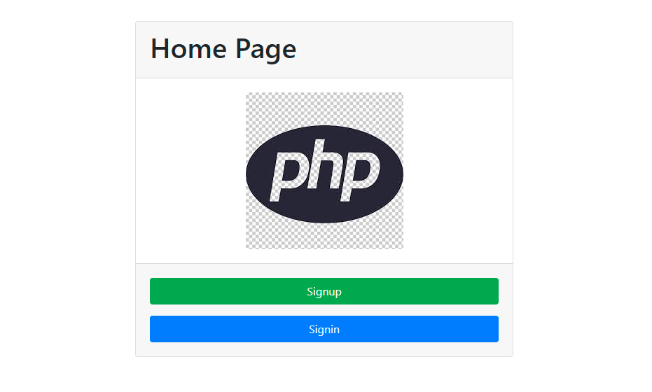
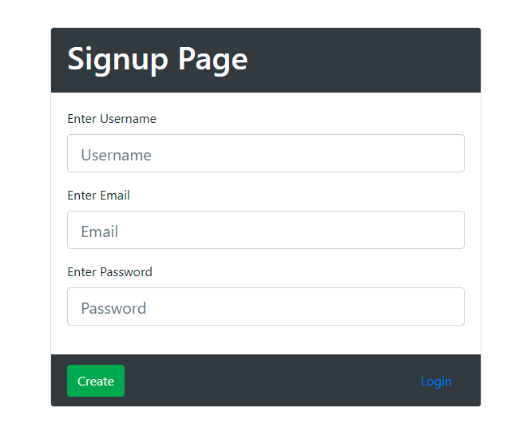
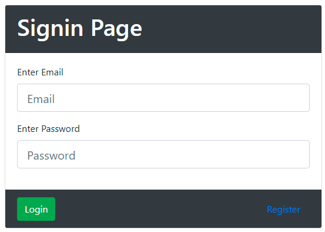
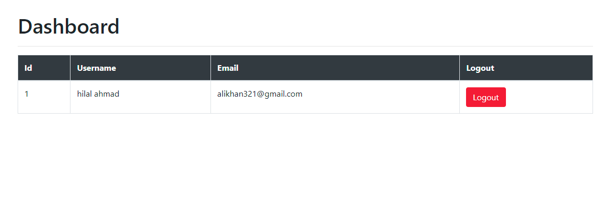

# login-registration-with-ajax
this is complete login and registration with php and mysqli and  ajax and jquey

# Download 
  1. Download the project
  2. unzip the file
  3. make a database php_registration_ajax or you can wirte your own
  4. import the database
  5. run the project in this url localhost/registration-ajax/index.php
  
# Home Page

# Registration Page

# Login Page

# Dashboard Page

